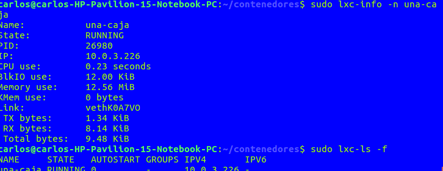
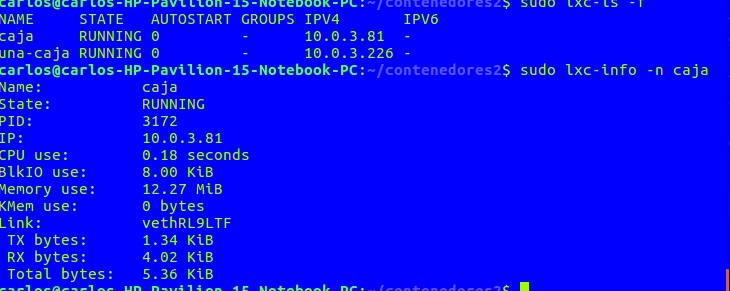
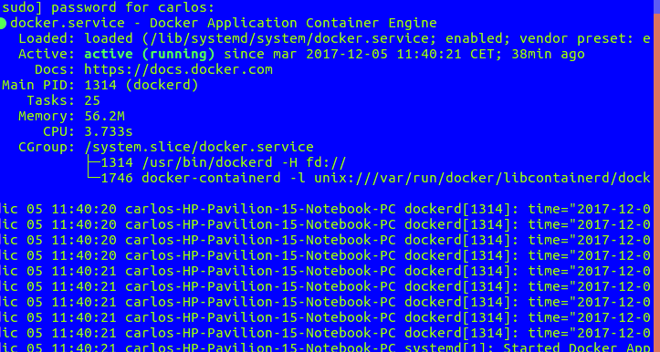
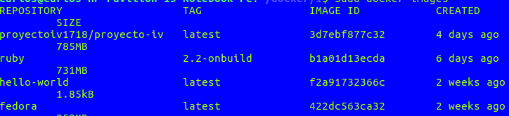
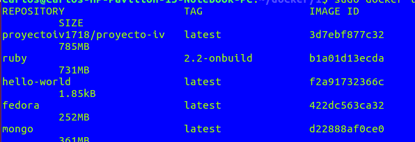

# 1. Instala LXC en tu versión de Linux favorita. Normalmente la versión en desarrollo, disponible tanto en GitHub como en el sitio web está bastante más avanzada; para evitar problemas sobre todo con las herramientas que vamos a ver más adelante, conviene que te instales la última versión y si es posible una igual o mayor a la 1.0.  
Se ha instalado lxc en ubuntu 16.04. Para instalar lxc se ha utilizado el comando sudo apt-geet install lxc como viene explicado en la página https://linuxcontainers.org/lxc/getting-started/  

# 2. Crear y ejecutar un contenedor basado en tu distribución y otro basado en otra distribución, tal como Fedora. Nota En general, crear un contenedor basado en tu distribución y otro basado en otra que no sea la tuya.

Se ha creado un contenedor ubuntu con el nombre una-caja como se muestra en a siguiente imagen.  
  

El otro contenedor que se va a instalar es debian con el nombre caja y se muestra como el contenedor de antes con la siguiente imagen.  

# 3. Instalar docker.  
Docker esta ya instalado ya que se ha utilizado para el proyecto de la asignatura. Se muestra una captura de docker ejecutándose en el terminal.  
  

# 4.1 Instalar a partir de docker una imagen alternativa de Ubuntu y alguna adicional, por ejemplo de CentOS.  
Hemos creado un contenedor en docker con la imagen de fedora que es la alternativa a ubuntu.  

# 4.2  Buscar e instalar una imagen que incluya MongoDB.  
Se ha creado un contenedor con la imagen mongo que contiene MOngoDB.  

# 7. Crear un Dockerfile para el servicio web que se ha venido desarrollando en el proyecto de la asignatura.  
El dockerfile desarrollado se puede ver en el enlace del proyecto en Carlos Sánchez Martínez en el fichero hito4.

# 8. Desplegar un contenedor en alguno de estos servicios, de prueba gratuita o gratuitos.  
Se ha desplegado la aplicación del proyecto de la asignatura que se acceder llendo al enlace del proyecto en el fichero hito4 y accediendo al enlace del contenedor.
